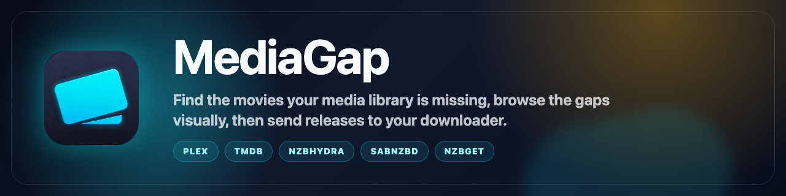
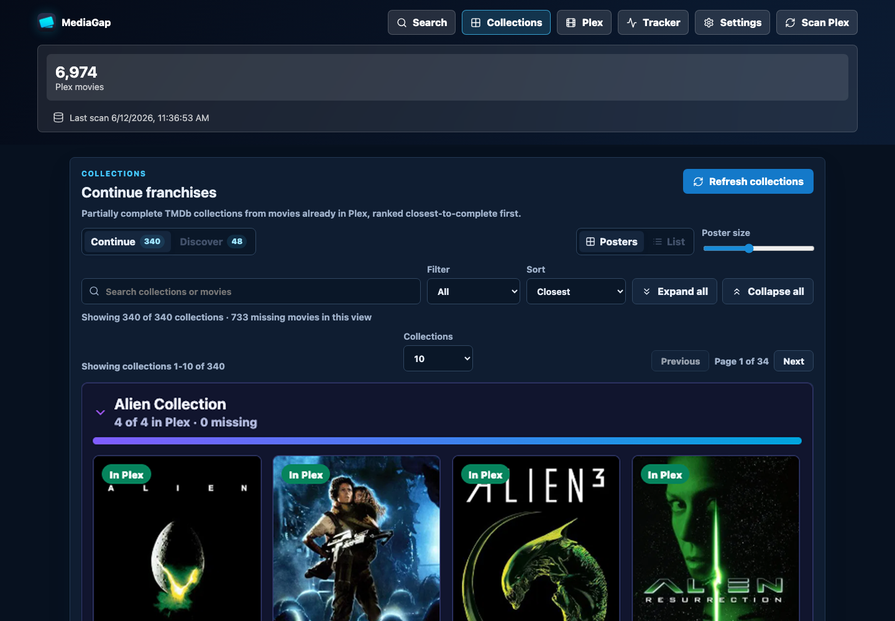

<div align="center">



<h1>MediaGap</h1>

<p><strong>Find the movies your media library is missing, then go get them.</strong></p>

<p>A local, self-hosted web app that compares your library against TMDb, shows you the gaps as a poster wall, completes your franchises, and hands missing titles off to NZBHydra or Seerr.</p>

<p>
  
  
  
  
  
</p>

</div>

<div align="center">
  
</div>

---

## Why MediaGap

Most "what's missing from my library" tooling is built for set-and-forget automation. MediaGap is built for browsing. Search an actor, a studio, or a franchise, and see at a glance, as a wall of posters, what you own and what you're missing. Then send the gaps wherever you already work.

- **Visual gap-finding.** Owned vs. missing at a glance, by person, movie, or studio. Not a config screen.
- **Franchise completion.** MediaGap finds the collections you've started but not finished ("you own 2 of 4 John Wick") and surfaces the missing entries, with junk like unreleased announcements filtered out.
- **Send the gaps where you already work.** Missing titles can flow into NZBHydra with quality/source filters (then to SABnzbd/NZBGet or a ZIP), or get requested straight from your Seerr instance. No copy-pasting.

> **Server support:** Plex, Jellyfin, and Emby are supported today. The library layer normalizes each server into the same local movie records.

---

## What v1 Does

- Connects to Plex with a manual base URL/token, or Jellyfin/Emby with a base URL/API key/user ID.
- Lets you choose which movie libraries to scan into a local SQLite database.
- Searches TMDb for people, movies, and studios.
- Finds partially complete TMDb movie collections from your scanned library.
- Compares TMDb movie results with the local media-server scan and marks movies **owned** or **missing**.
- Searches NZBHydra for missing movies with quality and source filters.
- Sends selected NZBs to SABnzbd/NZBGet, or downloads checked releases as a ZIP.
- Requests missing movies straight from your **Seerr** instance (the unified successor to Overseerr/Jellyseerr), which hands off to Radarr.
- Tracks downloader queue/history, with pause/resume controls.
- Rich movie detail view: backdrop, clearlogo title, IMDb/TMDb ratings, content rating, cast and director, trailer, and a one-click **Open in {server}** link for owned titles.
- Clickable cast and director jump straight to that person's filmography with owned/missing overlaid. A "Part of: ..." line links a movie to its franchise collection.
- Writes local app/integration logs to `data/app.log` by default.

> TV, Radarr/Sonarr direct, and per-indexer search are intentionally left for later versions.

---

## Getting Started

You need [Node.js](https://nodejs.org) 22.5 or newer installed. Then:

```bash
npm install
npm run build
npm start
```

Open **[http://localhost:4174](http://localhost:4174)** in your browser. That's it. The app and its API both run on this one address.

### Add a TMDb API key (required)

MediaGap needs a free TMDb API key to search and match movies. Search, collections, and movie details all depend on it. To get one, make a free account at [themoviedb.org](https://www.themoviedb.org), then go to Settings → API and request a developer key. Paste that key into MediaGap's own Settings page (the TMDb card) and save. Do this before you try to use the app, or every lookup will fail.

To use a different port:

```bash
PORT=8080 npm start
```

Then open `http://localhost:8080` instead.

### Prefer Docker?

Docker is optional, but if that's your thing:

```bash
docker compose up --build
```

Then open **[http://localhost:4174](http://localhost:4174)**.

### Developing or modifying MediaGap

Only needed if you want to edit the code with live reload. `npm run dev` starts the UI on `http://localhost:5173` (hot-reloading) and the API on `4174`. For just running the app, use the `npm start` steps above instead.

---

## Configuration

### Media Server

For Plex, paste a Plex token manually in Settings. For Jellyfin or Emby, enter the server URL, API key, and user ID or exact username. Credentials are stored locally in SQLite on your machine.

### Opening movies in your server

Owned movies show an **Open in {server}** button that deep-links straight to that title in your media server's web UI. The link is built from the server URL you configured, so it works wherever that URL is reachable: on your local network if you used a local IP (e.g. `http://192.168.x.x:32400`), or remotely if you configured a public domain/DDNS address.

### Requesting through Seerr

If you run [Seerr](https://seerr.dev) (the unified successor to Overseerr and Jellyseerr), add its URL and API key in Settings. Missing movies then show a **Request** button that sends the request straight to Seerr, which hands it to Radarr. Entirely optional, the discovery side works without it.

### Data

By default, local data is stored in `./data/app.db`. Set `DATABASE_PATH` to use another location.

Logs are written to `./data/app.log` by default and can be changed in Settings.

SABnzbd sends use file upload from the app server, so SAB does not need direct access to the NZBHydra release URL.

### Collections

The Collections view uses owned movies with TMDb IDs to find franchises you have started but have not finished. Refreshing collections caches TMDb collection members in SQLite, then overlays owned/missing status using the same matching and NZBHydra handoff as search results.

---

## Roadmap

- [x] Jellyfin library support
- [x] Emby library support
- [x] Seerr integration (request missing movies)
- [ ] Trakt / Simkl watchlist comparison
- [ ] "Discover" collections: browse famous franchises you own none of
- [ ] Bulk "grab all missing" per collection
- [ ] TV support (Sonarr)

---

## License

[MIT](LICENSE). Do what you like, no warranty.
